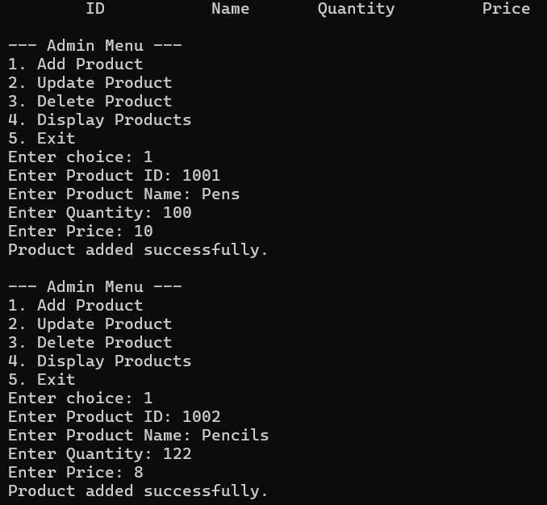
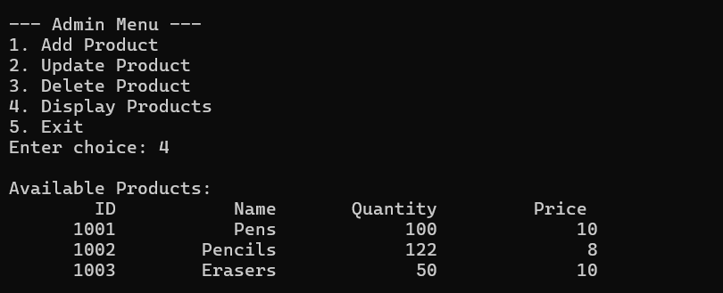
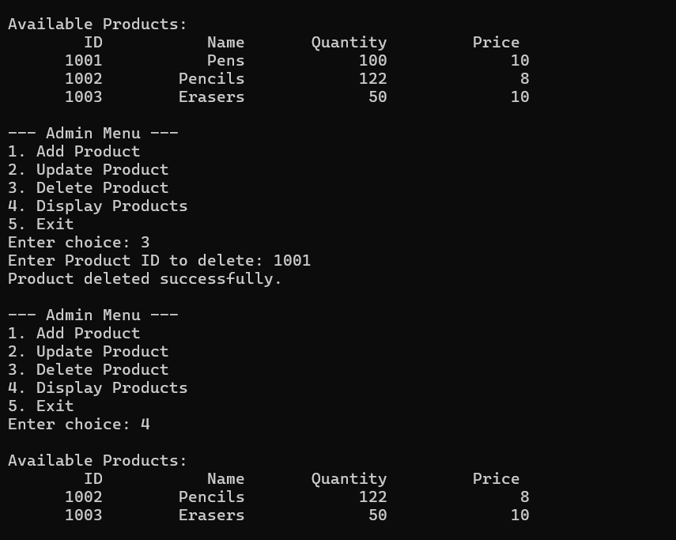
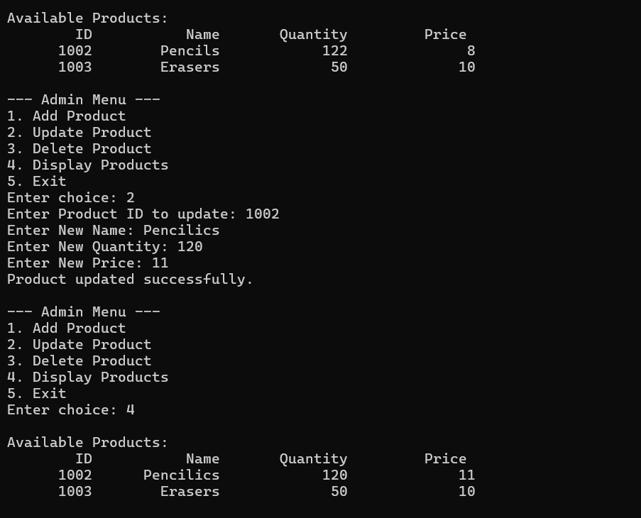
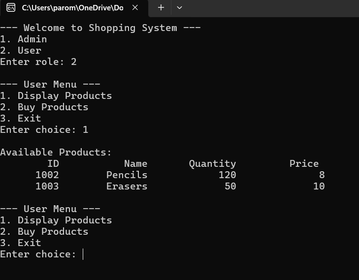
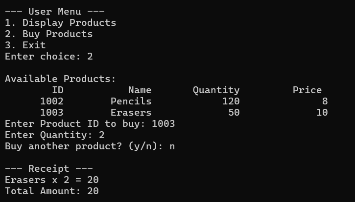
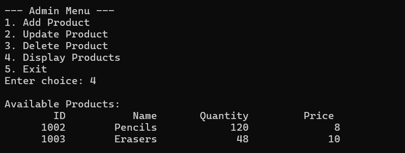

# Stock-and-Billing-System

This is a console-based system developed in C++, utilizing Object-Oriented Programming principles and basic file handling techniques. The system enables administrators to manage product inventory, while users can view and purchase products. 

Password for admin login: 123

Admin Panel can:
Add new products to the inventory
Update product details
Delete products from the inventory
View products of own inventory

User Panel can:
View available products
Purchase products, with receipt generation

Data storage in a local text file (database.txt)

